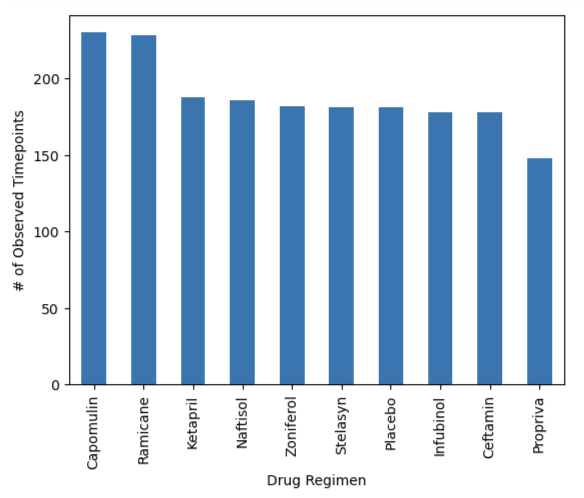
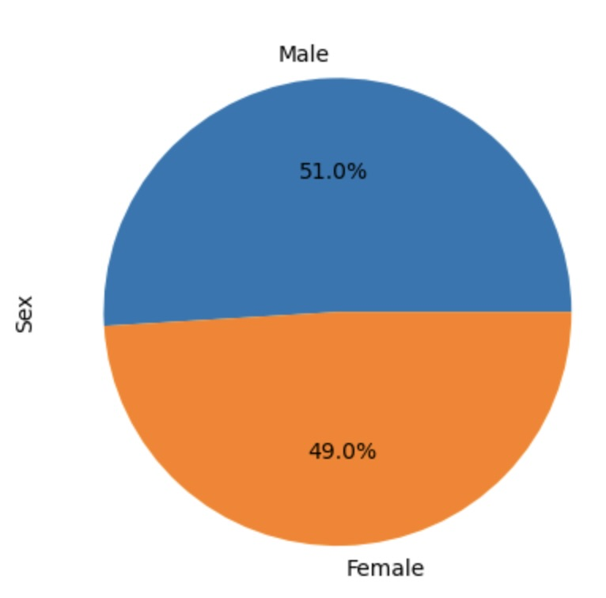
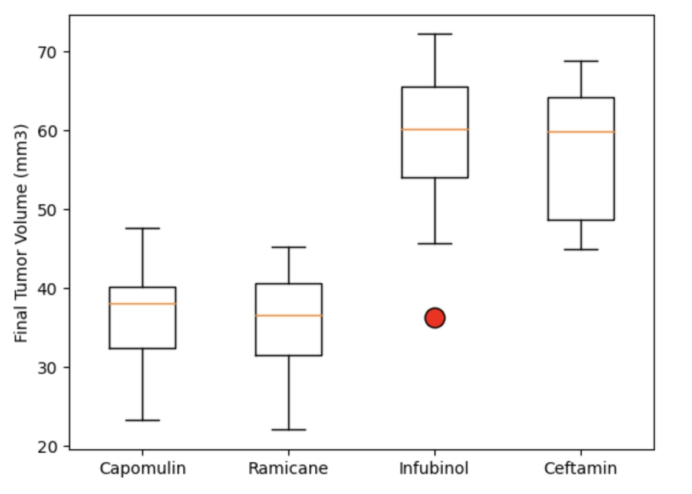
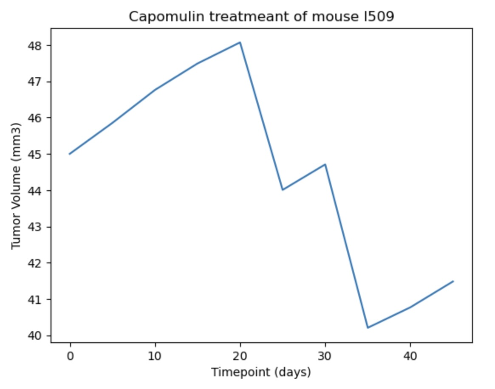
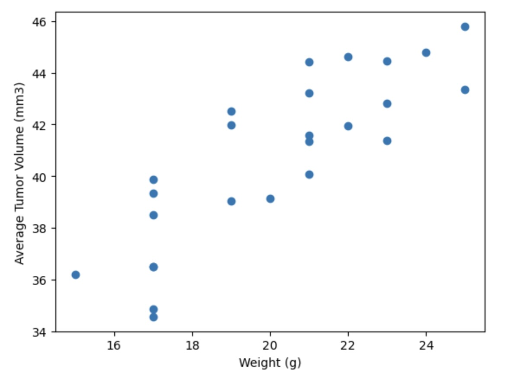
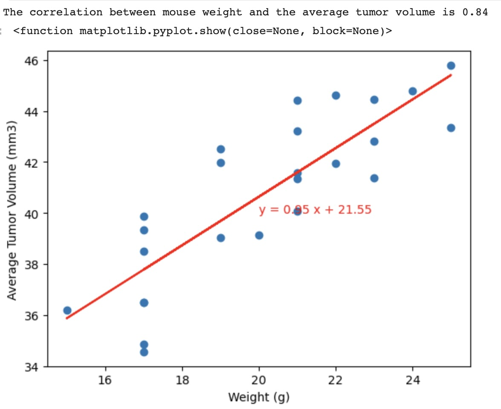

# Pharmaceutical Data Analysis

## Analyzing pharmaceutical data using data visualization. 

#### The purpose of this study was to compare the performance of Pymaceuticals’ drug of interest, Capomulin, against the other treatment regimens and generate all of the tables and figures needed for the technical report of the clinical study. 

#### In this project the following statistical methods and visualization techniques were used in analyzing the data:

- Preparation and cleaning of data
- Generation of summary statistics
- Creation of bar charts and pie charts

- Calculation of quartiles, finding outliers, and creation of a box plot

- Creation of a line plot and a scatter plot

- Calculation of correlation and regression

- Submission of final analysis

	
